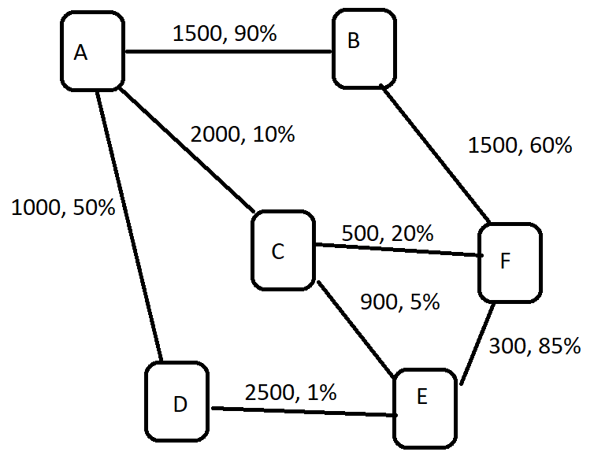

# Практическое задание 1

## Применение структур для представления данных

**Условие**

Используя информацию об общих подходах к хранению данных, необходимо сформировать программное представление исходных
данных задания.

Задание включает следующие установки:

- можно выбрать любой язык программирования при условии поддержки им ООП или структур;
- задание одно, однако требует двух форм решения, представленных по отдельности;
- исходные данные представлены в форме изображения схемы некоторой сети маршрутизаторов (рис. 1). Узлом в ней являются
  сами маршрутизаторы с их названиями (A, B, C, D, E, F), а рёбра отображают наличие связи между узлами. Для каждого
  ребра задано два значения: номинальная пропускная способность сети в МБ и процент потерь при передаче данных между
  связанными этими рёбрами узлами.

**Задание**

1. Необходимо реализовать схему сети, представленную на рисунке 1, таким образом, чтобы для выражения узлов и связей
   применялся подход с использованием массива. Нужно постараться избежать применения объектов узлов (нод).
2. Необходимо реализовать схему сети, представленную на рисунке 1, таким образом, чтобы для выражения узлов и связей
   применялся подход с использованием связанных узлов. Обратите внимание, что в этом задании не должно быть глобального
   массива данных всех узлов.

**ПО для выполнения задания и как развернуть окружение**

Выполнять задание можно в любой IDE.

**Формат результата**

Решение должно быть представлено в форме исходного кода, включающего:

1) Метод с названием matrixNet, формирующий и возвращающий схему сети в виде массива.
2) Метод с названием nodesNet, формирующий и возвращающий схему сети в виде узлов (нод).
3) Классы (структуры) для описания узлов сети.

