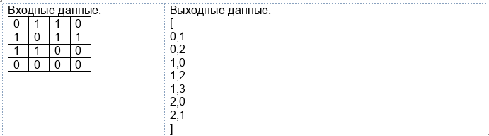
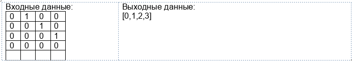

# Практическое задание 5

**Условие**

В рамках материала, посвященного теории графов, необходимо выполнить два практических задания. В первом задании
необходимо преобразовать граф из одной формы представления в другую. Данная задача подчёркивает базовую идею вебинара:
все формы представления графа равносильны друг другу. В рамках второго задания необходимо реализовать функцию
топологической сортировки, что потребует применения знаний о способах обхода графа.

**Задание**

**Задание 1.** Напишите функцию, реализующую преобразование матрицы смежности в список ребер.

Входными параметрами функции будет двумерный массив чисел, где на пересечении столбца и строки будет находиться 1 или 0,
где 1 означает, что ребро есть, а 0 — что ребра нет.

Выходным значением будет двумерный массив чисел, где в каждой строке будет два числа: номер узла, откуда выходит ребро,
и номер узла, куда входит ребро.

Обратите внимание, что исходная матрица смежности не указывает на то, является ли граф ориентированным или нет, поэтому
будем считать его ориентированным.

Пример:

**Задание 2.** Реализуйте функцию топологической сортировки ориентированного ациклического графа, заданного в виде
матрицы смежности

Входными параметрами функции будет двумерный массив чисел, где на пересечении столбца и строки будет находиться 1 или 0,
где 1 означает, что ребро есть, а 0 — что ребра нет.

Выходным значением будет массив чисел, в котором каждое число означает номер узла.

Пример:

**ПО для выполнения задания и как развернуть окружение**

Выполнять задание можно в любой IDE.

**Формат результата**

Решение должно быть представлено в форме исходного кода, включающего реализованный код и тесты демонстрации его
работоспособности.

